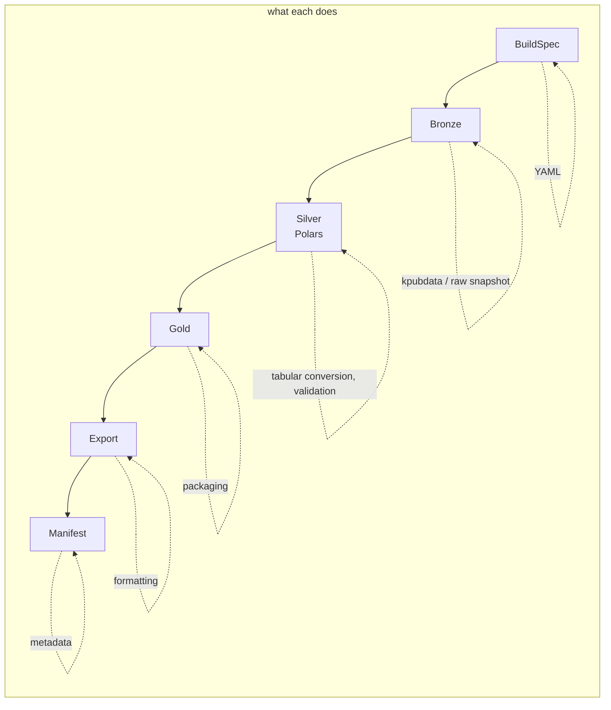
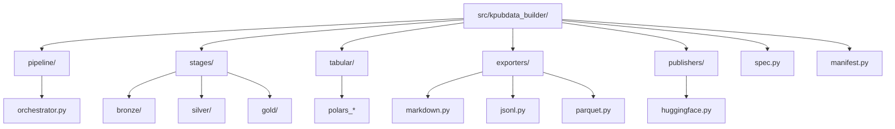
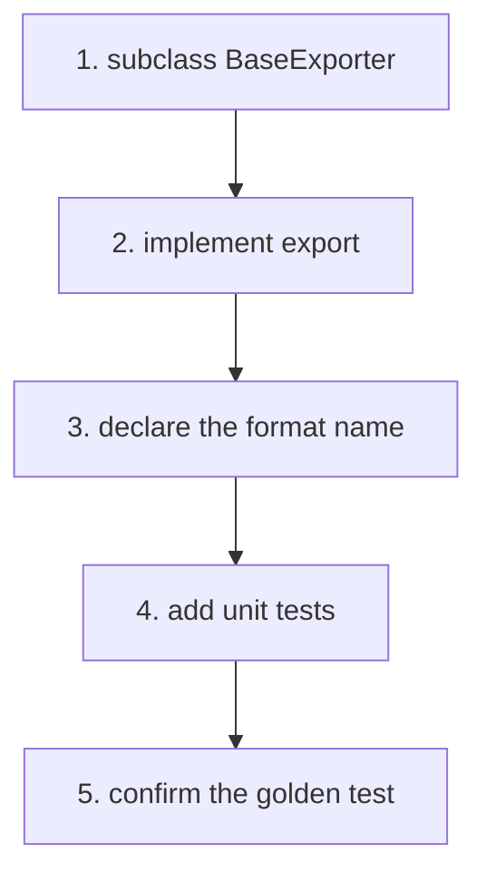

# AGENTS.md — kpubdata-builder

> **[POLICY.md](https://github.com/yeongseon/kpubdata/blob/main/docs/governance/POLICY.md)
> is the single canonical source for project-management and review policy.** Epic,
> Issue, Priority, Review Level, Verification and Release rules come from there.
> This file keeps only what is specific to this repository — build commands and
> directory rules. POLICY.md wins any conflict.

## Mission

Implement KPubData Builder: the orchestration and artifact-pipeline layer that
runs on top of `kpubdata`.

## Ground rules

- Do not reimplement `kpubdata`'s provider logic here.
- Keep build specs declarative.
- Prefer deterministic behaviour over anything that looks like magic.
- Keep exporters pluggable.
- Every build produces a manifest.
- Validation fails fast and says why.

## Language policy

> [kpubdata ADR 0003](https://github.com/yeongseon/kpubdata/blob/main/docs/adrs/0003-language-policy.md)
> is canonical. The evidence (measurements across ten Korean OSS projects) and the
> rejected alternatives are there.

**Titles are English; bodies are free.** Titles show up in lists, searches and
release notes.

| Area | Language |
|---|---|
| Code identifiers, comments, docstrings | English |
| Commit messages | English |
| **PR titles** | English (Conventional Commits) — a squash merge turns it into a commit |
| CHANGELOG and release notes | English |
| **Governance documents** (`AGENTS.md`, `CONTRIBUTING.md`) | English |
| **README** | Korean first, with an English section in the same file |
| **Issue titles** | English |
| Issue bodies | Korean or English |
| PR bodies and review comments | Korean or English |
| Korean-domain documents (활용신청, 공공누리 procedures) | Korean |
| User-visible string literals | **Out of scope** — runtime behaviour, decided separately |

Operating rules:

- Answer an issue in the language it was written in.
- Write `good first issue` in English, or in both.
- **Do not let English block a contribution.** If a title is hard to write in
  English, open it in Korean and say so — triage and review will sort it out.

### Comments and docstrings are gated, not merely requested

The rule above went unenforced long enough to accumulate 3,878 Korean comments and
docstrings across 255 files. `scripts/check_korean_comments.py` is a ratchet: it
freezes the current per-file count and fails only when a count grows, or when a
file absent from the baseline has any. Write new code in English; the existing
debt is paid down separately (#710).

## Labels — what to apply

POLICY sections 2.1, 2.1.1 and 2.1.2 are canonical. **Do not create a label that
is not in the table below.** Adding one goes through `epic:governance`.

| Axis | Labels | Who |
|---|---|---|
| Epic | `epic:trust` `epic:warehouse` `epic:governance` `epic:byok` `epic:policy` `epic:datasets` `epic:distribution` `epic:brand` `epic:onboarding` | Anyone may apply an existing label. **Only a person creates a new `epic:*`** |
| Priority | `priority:critical` `priority:high` `priority:medium` `priority:low` | **Only a person promotes to High or above** (POLICY 8) |
| Review Level | `review:R0` – `review:R3` | Assigned by path. **Only a person lowers one** |
| Type | `type:feat` `type:bug` `type:docs` `type:chore` `type:test` `type:refactor` | Anyone |
| Area | `area:*` | Anyone |

A new issue carries **at least `epic:*` and `type:*`**. Leave Priority off when
there is no evidence for it — POLICY 8 requires `Impact:`, `Blocks:` and
`Evidence:` for High and above, and a rating without evidence is a wrong rating.

What an agent does not do:

- Promote to `priority:high` or `priority:critical` — that is a person's judgement.
- Create a new `epic:*` label.
- Lower a `review:*` level.
- Create an Epic issue. Epic is a label (POLICY 4.1).

`P0` / `P1` / `P2` are **retired.** Do not substitute them mechanically for
`priority:*` — POLICY 8 requires a re-rating from zero, so that a wrong priority
does not survive under a new name.

Do not prefix a title with `GOV-01:` or `WH-03:`. Those are serial numbers from a
backlog document, not the issue's name. Labels do the classifying.

## Branch rules

- The default branch is `main`. **Never push to `main` directly.** Branch
  protection now enforces this, so a direct push is refused rather than merely
  discouraged.
- Always work on a feature branch and open a PR.
- Branch names: `feat/issue-<number>-<short-description>`,
  `fix/issue-<number>-<short-description>`, `docs/<short-description>`.
- Never force-push to `main`. Never delete `main`.
- Do not rename or delete a branch you did not create.
- If a git operation is not obviously safe, **ask instead of guessing.**

## Build order

1. The spec model
2. Medallion pipeline orchestration
3. Source execution through `kpubdata`
4. The Polars tabular engine and Silver validation
5. The artifact model and Gold packaging
6. The Markdown exporter
7. The HuggingFace layout exporter
8. Stage-aware publish hooks

## Test expectations

- Unit tests for spec validation
- Stage-aware tests for Bronze/Silver/Gold promotion
- Golden tests for Markdown output
- Manifest contract tests
- Fixture-based source execution tests

---

## How this project fits together

`kpubdata` fetches; this repository turns what it fetched into published
artifacts. Collection, validation and packaging each happen in a named stage, and
every build leaves a manifest describing what came out.

### Vocabulary

| Term | Meaning |
| :--- | :--- |
| **BuildSpec** | Declares what to collect, how to shape it and where it goes |
| **Bronze** | First stage: raw collection results and the source snapshot |
| **Silver** | Middle stage: Polars tabular conversion, validation, statistics, preview |
| **Gold** | Final internal stage: partitioning and an export-ready package |
| **Artifact** | Something a build produced (a file, usually) |
| **Manifest** | The specification of what a build produced — version, timestamps, digests |
| **Polars** | The one tabular engine, used for Silver conversion and validation |
| **Exporter** | Converts data into a format (Markdown, JSONL, Parquet, HuggingFace) |
| **Publisher** | Uploads a finished artifact somewhere (GitHub, HF Hub) |
| **Golden Test** | Compares current output against a stored known-good file |

### Pipeline flow



```text
[BuildSpec] -> [Bronze: raw collection] -> [Silver: Polars conversion and validation]
            -> [Gold: packaging] -> [Export: formatting] -> [Manifest: metadata]
```

## Agent coding rules

### Prompts that work

- "Add a `CSVExporter`. Follow `exporters/base.py` and implement `ExportModel`."
- "Add filter conditions to the `BuildSpec` model."

### Forbidden

- **Duplicating `kpubdata` logic.** Parsing belongs there. Here you only handle
  what came back.
- **Unclear output paths.** Where a file is written is always explicit.
- **A build without a manifest.** Every build output includes `manifest.json`.

### Before handing work back

- [ ] Does `uv run ruff check .` pass?
- [ ] Are the Bronze/Silver/Gold responsibilities kept distinct in both the code
  and the docs?
- [ ] Does the new exporter have unit tests?
- [ ] If the change needs a stage-aware test or a fixture, is it there?
- [ ] Does a golden test confirm the output is what you intended?

## Directory layout



```text
src/kpubdata_builder/
├── pipeline/        # medallion stage flow control
├── stages/          # bronze, silver, gold implementations
├── tabular/         # Polars-based tabular processing
├── exporters/       # format conversion (Markdown, JSONL, Parquet)
├── publishers/      # artifact upload (HF, GitHub)
├── service/         # HTTP service mode (app.py, http.py, auth.py)
├── store/           # BuildIndex — derived SQLite index (ADR 0003)
├── warehouse/       # table catalog: immutable snapshots, CAS pointer (#699)
├── spec/            # BuildSpec definition and validation
└── manifest/        # manifest generation
```

### Which file to change

- **A new output format**: add a file under `exporters/`.
- **Uploading somewhere new**: add logic under `publishers/`.
- **Changing stage promotion rules**: review `pipeline/` and `stages/` together.

## Adding an exporter



1. Subclass `BaseExporter` from `exporters/base.py`.
2. Implement `export(self, artifacts: List[Artifact]) -> List[Path]`.
3. Declare the supported format name as a class variable.
4. Add tests to `tests/unit/test_exporters.py`.

### What a golden test is

When the output is text, such as Markdown, a golden test compares it line for line
against a stored known-good file. It catches a formatting change that no assertion
would notice.

---

## Related documents

### In this repository

| Document | What it covers |
| :--- | :--- |
| [CONTRIBUTING.md](./CONTRIBUTING.md) | How to contribute |
| [ARCHITECTURE.md](./ARCHITECTURE.md) | System architecture |
| [DOMAIN_MODEL.md](./DOMAIN_MODEL.md) | Domain model |
| [EXPORT_MODEL.md](./EXPORT_MODEL.md) | Export model |
| [API_CONTRACT.md](./API_CONTRACT.md) | API contract |
| [PRD.md](./PRD.md) | Product requirements |
| [ROADMAP.md](./ROADMAP.md) | Roadmap |
| [CREDENTIAL_SURFACE.md](https://github.com/yeongseon/kpubdata-builder/blob/main/docs/CREDENTIAL_SURFACE.md) | Every place a user key can persist |
| [SECURITY.md](https://github.com/yeongseon/kpubdata-builder/blob/main/SECURITY.md) | Security policy and known limits |

### KPubData product family

| Repository | Document | What it covers |
| :--- | :--- | :--- |
| [kpubdata](https://github.com/yeongseon/kpubdata) | [AGENTS.md](https://github.com/yeongseon/kpubdata/blob/main/AGENTS.md) | Core agent guide |
| [kpubdata-studio](https://github.com/yeongseon/kpubdata-studio) | [AGENTS.md](https://github.com/yeongseon/kpubdata-studio/blob/main/AGENTS.md) | Studio agent guide |
