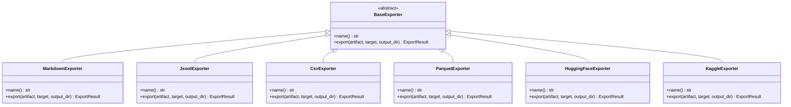
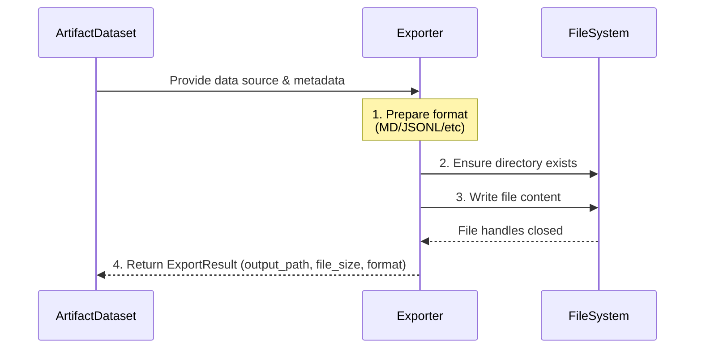
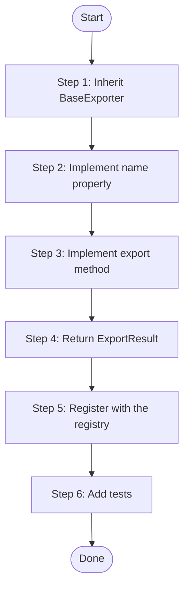
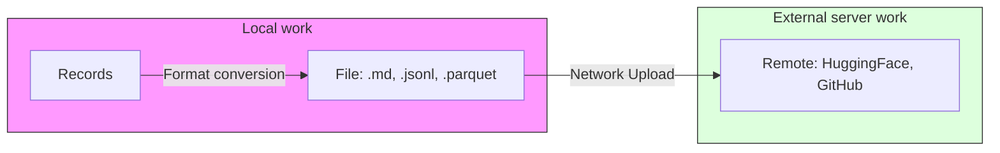

# Export Model — KPubData Builder

## 0. "What is an Exporter?" (Beginner's Explanation)

An exporter is a **data converter**.

Data that KPubData Builder collects from various sources exists only in the computer's memory. For users to actually read this data as files, it must be written in a specific format (e.g., Markdown readable in any text editor, Parquet similar to a spreadsheet). The exporter is what performs this role.

## 1. Philosophy

An exporter takes the standard artifact model as input and produces a concrete file or publishable layout.



They must not fetch source data themselves. (They do not call APIs to get data; they only use the already-prepared `ArtifactDataset` to produce files.)



## 2. Standard Export Input (What the Exporter Receives)

Every exporter receives the following:
- Data source (the actual data content — §2.1, #873)
- Metadata (supplementary information such as author, creation date)
- Provenance (where this data came from)
- Schema summary (the names and types of the data fields)
- Optional statistics (row count, averages, etc.)

### 2.1 Data source (#873, 0.x breaking)

`ArtifactDataset` no longer holds a records tuple (`records`). Rows are read through `artifact.data_source` (`ArtifactDataSource`).

```python
class ArtifactDataSource(Protocol):
    @property
    def row_count(self) -> int: ...
    @property
    def parquet_path(self) -> Path | None: ...
    def iter_records(self, *, batch_size: int = 1000) -> Iterator[dict[str, JsonValue]]: ...
```

- **Re-readable.** `iter_records()` starts fresh from the first row on each call (not a one-shot generator). One exporter can read twice (column names first, values later), and multiple exporters can read from the same source.
- **Does not hold everything in memory.** The canonical path's (BuildSpec Gold) source is `pipeline.export.TableSource`, which reads the Gold DuckDB table in batches — only one batch is in Python at a time.
- **Parquet fast-path.** When `parquet_path` is present (Gold's `table.parquet`), exporters that write Parquet copy that file — they do not re-read rows to build a dataframe. The built-in `parquet` and `huggingface` (parquet format) do this.
- **Metadata, provenance, schema and statistics are separate from the data**, remaining as fields of `ArtifactDataset`.
- To create an artifact from records already in memory, use `ArtifactDataset.from_records(records, schema=..., ...)` (`RecordsSource`) — for tests, small artifacts, and plugins that produce their own records.

All built-in exporters have moved to this contract: CSV and Kaggle (with CSV formula-injection defence intact) and JSONL stream in batches to a temporary file then replace; Markdown reads only 5 sample rows and takes the row count from `row_count`.

## 3. Built-in Exporters (Default Converters)

The following exporters are built into `kpubdata_builder.exporters` and available without separate installation.

### 3.1 Markdown (`kind: markdown`)
- **Output format:** Human-readable document format (`.md`)
- **Contents:** Dataset description, per-field description table, sample data rows, source information section
- **Example:**
  ```markdown
  # 2025 Weather Report
  This dataset was generated through the Korea Meteorological Administration API.
  | Date | Temperature | Weather |
  | --- | --- | --- |
  | 2025-04-01 | 15°C | Clear |
  ```

### 3.2 JSONL (`kind: jsonl`)
- **Output format:** A text file with one JSON object per line (`.jsonl`)
- **Characteristics:** Very convenient for developers to read and process line by line.
- **Example:**
  ```json
  {"date": "2025-04-01", "temp": 15, "sky": "sunny"}
  {"date": "2025-04-01", "temp": 16, "sky": "cloudy"}
  ```

### 3.3 CSV (`kind: csv`)
- **Output format:** Comma-separated tabular text file (`.csv`)
- **Characteristics:** Widely supported by spreadsheets and data analysis tools.

### 3.4 Parquet (`kind: parquet`)
- **Output format:** A binary file optimized for large-scale data processing (`.parquet`)
- **Characteristics:** Very compact and very fast to read. (Cannot be read in a plain text editor.)

### 3.5 Hugging Face Layout (`kind: huggingface`)
- **Output format:** A file structure suitable for uploading to Hugging Face, the AI model sharing site
- **Contents:** Data files inside a `data/` folder, `README.md` (Dataset Card), configuration metadata

### 3.6 Kaggle (`kind: kaggle`)
- **Output format:** File structure and metadata matching a Kaggle Dataset

## 4. Creating a New Exporter (Step-by-Step Tutorial)

To save data in a new format (e.g., XML), follow these steps.



### Step 1: Inherit BaseExporter
Create a new class inheriting from `BaseExporter`, defined in `exporters/base.py`.

### Step 2: Implement the `name` property and `export` method

The `export` method signature must be exactly as follows.

```python
# exporters/xml.py example (how to write it)
from pathlib import Path
from .base import BaseExporter, ExportResult, ensure_output_dir
from ..artifact import ArtifactDataset
from ..spec import ExportTarget

class XmlExporter(BaseExporter):
    @property
    def name(self) -> str:
        return "xml"

    def export(
        self,
        artifact: ArtifactDataset,
        target: ExportTarget,
        output_dir: Path,
    ) -> ExportResult:
        # 1. Prepare a safe output path (including PathTraversalError prevention)
        out_file = ensure_output_dir(output_dir, target.output_path)

        # 2. Write the file
        out_file.write_text("<data/>", encoding="utf-8")

        # 3. Return ExportResult
        return ExportResult(
            output_path=out_file,
            file_size=out_file.stat().st_size,
            format=self.name,
        )
```

### Step 3: Register with the Registry

```python
from kpubdata_builder.exporters import register_exporter
from my_package.exporters.xml import XmlExporter

register_exporter(XmlExporter())
```

Alternatively, you can register as a plugin by declaring in the `kpubdata_builder.exporters` entry point group in `pyproject.toml`. Note that declaring an entry point alone does not auto-load. For security and deterministic execution, `load_entry_point_exporters()` must be called explicitly at runtime to register into the registry.

```python
from kpubdata_builder.exporters import load_entry_point_exporters

# Call once at application startup to register plugin exporters
load_entry_point_exporters()
```

## 5. Publisher vs Exporter (Publisher vs Delivery)

Here are the differences between two concepts many people confuse.



| Distinction | Exporter (Converter) | Publisher (Delivery) |
| :--- | :--- | :--- |
| **What it does** | Produces data as a **file** in a specific format | **Sends/uploads** the produced file somewhere |
| **Where it runs** | Local computer | Transmits over the network to an external server |
| **Output** | Files: `.md`, `.jsonl`, `.parquet`, etc. | URLs of Hugging Face repositories, GitHub repositories, etc. |
| **Analogy** | Finishing cooking and packing it in a container | Delivering the packaged food to the customer's door |

---

## Exporter Contract (ADR 0004)

This section defines the stable contract that exporter implementations must follow. Per ADR 0004 (#310), the registration/discovery mechanism, `export()` signature, and failure semantics are codified.

### 6.1 Registration Contract

Exporters are registered in an **explicit registry**. Registration is possible in two ways:

**Method A: Factory registration (recommended, ADR 0004)**
```python
from kpubdata_builder.exporters import register_exporter_factory
from my_exporter import MyExporter

register_exporter_factory("myformat", MyExporter)
```
- A factory must return a **new instance** each time it is called with no arguments.
- Re-registering the same kind raises `ValueError` (explicit error).
- Overwriting is allowed only with the `override=True` option.

**Method B: Instance registration (legacy compatibility)**
```python
from kpubdata_builder.exporters import register_exporter
from my_exporter import MyExporter

register_exporter(MyExporter())
```

**Method C: Entry Points (auto-discovery)**
```python
# pyproject.toml
[project.entry-points."kpubdata_builder.exporters"]
myformat = "my_package:MyExporter"

# Runtime
from kpubdata_builder.exporters import load_entry_point_exporters
load_entry_point_exporters()
```

### 6.2 `export()` Method Contract

#### Signature
```python
def export(
    self,
    artifact: ArtifactDataset,  # Standard dataset artifact
    target: ExportTarget,        # kind, output_path, options
    output_dir: Path,            # Base output directory
) -> ExportResult:
    ...
```

#### Inputs
- `artifact`: `ArtifactDataset` — data source (§2.1), metadata, provenance, schema summary
- `target`: `ExportTarget` — exporter kind, relative output path, per-exporter options
- `output_dir`: `Path` — base directory for all outputs (guaranteed by the path safety module)

#### Returns
- `ExportResult` — metadata of the produced file:
  - `output_path`: absolute path of the produced file
  - `file_size`: file size in bytes
  - `format`: exporter identifier

### 6.3 Failure and Partial Output Contract

#### Exception Convention
Exporters **raise exceptions** on failure. All I/O errors must be wrapped in `ExportError`.

```python
from ..errors import ExportError

try:
    # File writing and other I/O operations
except OSError as exc:
    raise ExportError(f"Failed to export: {exc}") from exc
```

#### No Partial Output (Atomicity)
Exporters follow the **"all or nothing"** principle:
- On success: all files are written correctly and `ExportResult` is returned
- On failure: no files are written (or partial output is explicitly marked)

The atomic write pattern using a temporary file (`.tmp`) is recommended:

```python
import tempfile
import os
from contextlib import suppress

def export(self, artifact, target, output_dir) -> ExportResult:
    destination = ensure_output_dir(output_dir, target.output_path)
    content = self._format(artifact)  # Hypothetical formatting method

    fd, tmp_name = tempfile.mkstemp(dir=destination.parent, suffix=".tmp")
    try:
        with os.fdopen(fd, "w", encoding="utf-8") as f:
            f.write(content)
        os.replace(tmp_name, destination)  # atomic
    except BaseException:
        with suppress(OSError):
            os.unlink(tmp_name)  # Remove temporary file on failure
        raise ExportError(f"Failed to write {destination}")
```

#### Explicit Partial Output (Optional)
Some exporters may intentionally provide partial output (e.g., for large-scale data processing). In this case, **partial output must be explicitly marked**. Currently unused in the implementation.

### 6.4 Path Safety Contract

Exporters cannot write files outside `output_dir`:
- The `ensure_output_dir()` helper must be used to guarantee path safety (#210).
- Malicious `output_path` (e.g., `../../../etc/passwd`) is rejected with `PathTraversalError`.

```python
from .base import ensure_output_dir

def export(self, artifact, target, output_dir) -> ExportResult:
    # safe_output_path checks that it stays inside output_dir
    destination = ensure_output_dir(output_dir, target.output_path)
    ...
```

---

## Related Documents

### Documents in This Repository
| Document | Description |
| :--- | :--- |
| [DOMAIN_MODEL.md](./DOMAIN_MODEL.md) | Domain model definitions |
| [ARCHITECTURE.md](./ARCHITECTURE.md) | System architecture design |
| [API_CONTRACT.md](./API_CONTRACT.md) | API interface contract |
| [AGENTS.md](./AGENTS.md) | Golden test requirements and development checklist |

### Upstream ADRs
| ADR | Title | Status |
| :--- | :--- | :--- |
| [ADR 0004](./adrs/0004-plugin-exporter-contract.md) | Plugin Exporter API contract stabilization | Approved |
